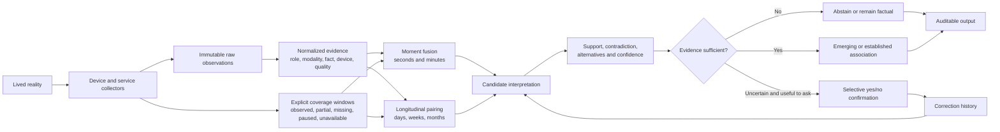

# ATIRA's brain under the hood

## Ontological reasoning and audit guide

**Status:** implemented foundation, not a validated personal model  
**Audience:** product owner, engineers, future reviewers, and anyone evaluating whether an ATIRA insight deserves trust

ATIRA's central problem is not collecting the largest possible pile of data. It is deciding what that data permits the product to say about a person's lived reality.

That distinction is the ontology. A foreground application is not automatically work. A calendar event is not attendance. A high heart rate is not automatically exercise. A location is not a purpose. An absent signal is not zero activity. ATIRA must preserve those boundaries even when a more confident story would look better in the interface.

The current reasoning system is a deterministic inference kernel, not an opaque AI model. It normalizes evidence, checks whether the relevant collectors were actually observing, combines independent sources using explicit rules, preserves contradictions, and either produces a bounded interpretation or abstains. That is the trustworthy foundation, not the limit of the product. ATIRA's intended destination is a proactive personal model that searches across the whole evidence history for explanations, makes falsifiable assertions, learns from correction and future outcomes, and progressively describes not only what a person did but how they characteristically respond to life.

## The governing philosophy

ATIRA should optimize for **explanatory value under inspectable uncertainty**. The user is authorizing the product to interpret, not merely archive. ATIRA is therefore allowed to be wrong; it is not allowed to be arbitrary, untraceable, stubborn after correction, or falsely certain about the evidence it possessed.

The product should actively generate and test plausible explanations. It should make the strongest assertion justified by the current personal model, present that assertion plainly, and keep confidence, evidence, alternatives and corrections one layer beneath the headline. Abstention remains correct when collection is genuinely missing or no coherent hypothesis exists, but caution must not become an excuse to avoid useful judgment.

The engine follows ten principles:

1. **Evidence before story.** It records what a collector observed before assigning meaning.
2. **Interpretation is the mandate.** Every meaningful event should be tested against relevant prior, concurrent and subsequent context for explanatory relationships.
3. **Assertions are falsifiable.** ATIRA may reach beyond a directly observed fact into an inference when it can expose why, offer competing explanations and revise the judgment later.
4. **Independent sources matter.** Two observations from one underlying sensor are not automatically corroboration.
5. **Coverage is evidence.** The engine must know when a collector was operating before interpreting silence.
6. **Contradictions remain visible.** Conflicting evidence lowers confidence; it is not silently discarded to protect a narrative.
7. **Declared intention is not observed behaviour.** Calendar data may describe anticipation, never completed reality by itself.
8. **Confirmation corrects an instance.** A user's yes or no outranks the candidate interpretation for that event, but does not prove a universal rule about the user.
9. **Patterns should predict.** A hypothesis becomes valuable when it explains prior events and improves predictions about comparable future events.
10. **Personal character is a living model.** Repeated routines, reactions and recovery patterns may support assertive statements about tendencies, but those tendencies retain evidence, scope, confidence and a capacity to change.

Evidence boundaries still matter: direct observation, interpretation and personal tendency are different ontological layers. The solution is not to flatten them into equally timid copy. It is to let the user see a clear conclusion while keeping the reasoning layer honest and auditable.

## The reasoning pipeline



There are two separate reasoning clocks:

- **Moment reconstruction** asks what can be supported about an interval lasting seconds or minutes.
- **Longitudinal analysis** asks whether measurements repeatedly move together over days or months.

A plausible moment does not automatically become a life pattern. A longitudinal correlation does not rewrite the underlying moments as causal facts.

## Target architecture: a living personal event graph

The implemented pairwise rules are scaffolding. The destination is not a catalogue of isolated rules such as “phone plus idle equals attention shift.” It is a time-aware event graph in which every recorded action can become context for every other action when the relationship has potential explanatory value.

The graph contains several kinds of node:

- raw observations from devices and providers;
- reconstructed episodes such as a call, commute, focused work block, workout, sleep period or place visit;
- surrounding states such as sleep debt, recent movement, location, interaction intensity and time of week;
- recurring-event clusters such as “the Wednesday Teams call” even before ATIRA understands its social meaning;
- hypotheses explaining an episode or difference between comparable episodes;
- learned personal tendencies that summarize repeated and predictive responses.

Edges describe relationships rather than assuming causation: overlaps, precedes, follows, occurs at, occurs on, uses device, belongs to recurring cluster, differs from personal baseline, is compatible with, contradicts, predicts, and was confirmed or rejected by the user.

“Consider every datapoint” does not mean blindly comparing every row with every other row forever. That would create combinatorial noise. It means no source is siloed by domain and every event is evaluated through multiple time horizons:

| Horizon | Questions ATIRA asks |
| --- | --- |
| Immediate | What was happening during the event and in the minutes immediately before and after it? |
| Daily | Did sleep, movement, place, meals, travel, prior work, digital intensity or recovery earlier that day change this event? |
| Cyclical | How does this event compare with the same weekday, recurring call, place, application pattern or routine? |
| Longitudinal | Does the relationship repeat across 28, 90 or more days, and does it predict future occurrences? |
| Personal-history | Is this typical for this person, device, place and life phase, rather than typical in a generic population? |

For each reconstructed episode, the future engine should build a context envelope containing before, during and after features; deviations from personal baselines; comparable-event controls; missing coverage; and candidate lagged relationships. It should then generate competing hypotheses, rank them by explanatory and predictive value, and update them as subsequent evidence arrives.

The engine therefore becomes progressive:

1. **Episode:** “A 60-minute Teams session occurred.”
2. **Contrast:** “This recurring Wednesday session produced a larger heart-rate response than the Monday and Friday sessions.”
3. **Hypothesis:** “The response may reflect meeting-related arousal, recent exercise, caffeine, sleep debt or another preceding condition.”
4. **Discrimination:** Timing and other sources make some explanations more plausible and others less plausible.
5. **Prediction:** The leading explanation predicts what should happen before, during or after the next comparable session.
6. **Personal tendency:** Repeated accurate predictions support a broader statement about how this person anticipates, responds to and recovers from this class of situation.

This is how ATIRA moves from passive day reconstruction toward a model of character without pretending that character is a fixed essence.

## Assertion ladder

ATIRA should not attach a disclaimer to every sentence. Instead, it should choose a statement from an explicit ladder and expose the reasoning on demand:

| Level | Product behaviour | Example |
| --- | --- | --- |
| Observation | State the measured fact | “Your heart rate rose 24 bpm during Wednesday's Teams call.” |
| Active hypothesis | Make a useful provisional judgment | “Wednesday's call appears more physiologically demanding than your other recurring calls.” |
| Established pattern | State a repeated relationship directly | “Wednesday is consistently your most physiologically demanding recurring meeting.” |
| Personal tendency | Describe a stable, scoped behavioural characteristic | “You show anticipatory arousal and slower recovery around this class of high-stakes interaction.” |

The headline is assertive. “Why ATIRA thinks this” contains the evidence, baseline, comparisons, coverage, alternatives, prediction record and corrections. A confidence label describes maturity without forcing the user to parse defensive wording.

The final level requires more than repeated correlation. It needs stable recurrence across enough comparable situations, discriminating evidence against obvious alternatives, successful prediction on later events, and resistance to one-off context changes. Personal tendencies should also decay or be re-estimated when recent behaviour changes.

## Worked example: three recurring Teams calls

Assume the user has one-hour Teams sessions every Monday, Wednesday and Friday. ATIRA notices a heart-rate spike during Wednesday's session.

A siloed engine would either ignore the health signal because the activity is sedentary or report the coincidence without trying to explain it. The intended engine does considerably more:

1. It clusters the three sessions as comparable recurring digital episodes using application, duration, cadence, device and optional declared calendar context.
2. It constructs context envelopes for each occurrence: heart-rate baseline and curve, motion, workout records, sleep, location, computer interaction intensity, phone activity, preceding applications, time since waking and post-call recovery.
3. It compares Wednesday with that user's Monday and Friday calls, not merely with a population average.
4. It distinguishes **onset shape**. A heart rate already elevated before the call with recent motion supports the exercise explanation. A rise beginning at call onset without motion supports meeting-linked arousal. A pre-call rise across repeated weeks suggests anticipation. Slow post-call recovery adds another characteristic.
5. It generates competing hypotheses rather than prematurely selecting one: meeting importance or hierarchy, preceding exercise, caffeine or meal timing, poor sleep, rushing to join, environmental heat, sensor error, or an unobserved factor.
6. It looks for discriminating evidence. Calendar title or participant context may support meeting identity but remains declared/contextual. Motion and workout evidence test the exercise explanation. Sleep tests fatigue. Similar physiological responses in other meetings with the same people may strengthen a social-context explanation.
7. If the distinction remains valuable but unresolved, it asks one cheap question such as: “Is Wednesday's call more important or senior than your other recurring calls?”
8. It predicts the next Wednesday response. Repeated success promotes the hypothesis; failure, contradictory context or a user rejection weakens or replaces it.

The eventual output can be direct:

> Wednesday's recurring call is your most physiologically demanding meeting. Your heart rate begins rising before it starts and takes longer to settle afterwards; this pattern has repeated in 8 of the last 10 sufficiently observed weeks. Exercise does not explain 7 of those occurrences.

If evidence later shows that the user consistently exercises before Wednesday's call, the judgment should change:

> The elevated heart rate around Wednesday's call is primarily explained by your pre-call workout, not the meeting itself.

Both are valuable judgments. The intelligence lies in actively attempting the explanation, distinguishing alternatives, and changing its mind for a reason.

## The evidence vocabulary

Every observation is normalized along independent dimensions so the system does not confuse *where it came from* with *what it means*.

### Evidence role

| Role | Meaning | Example |
| --- | --- | --- |
| `observed` | Directly recorded by a device or sensor | A desktop collector records Chrome in the foreground |
| `declared` | A human or service states an intention or description | A calendar says “team meeting” at 14:00 |
| `derived` | Deterministically constructed from traceable evidence | Location samples are clustered into a place-presence interval |
| `confirmed` | A user explicitly accepts an interpretation | The user confirms that a movement interval was a walk |

The role is not a confidence ladder. A declared event can be perfectly accurate as a declaration and still be incapable of proving attendance.

### Modality and fact

The current contracts distinguish source modalities such as digital activity, device state, location, motion, physiology, workout records, declared intent, and user confirmation. They separately describe facts such as digital activity, device away, device locked, a location sample, place presence, movement, sleep, heart rate, steps, a workout, or declared intent.

This separation matters. A provider may send a workout record, but it remains a health-provider observation until another source corroborates physical movement. Likewise, browser context is digital evidence even when a domain is commonly associated with work or entertainment.

### Lineage and independence

Normalized evidence retains its raw observation IDs and the source lineage from which it was derived. The engine counts observed lineage sources rather than merely counting rows. Ten samples from the same collector do not become ten independent witnesses.

Today, independence is represented coarsely by source type. A future dependency graph should also describe cases where two providers ultimately rely on the same physical sensor, account, or operating-system feed.

## What each source can and cannot say

| Source | It may establish | It cannot establish alone |
| --- | --- | --- |
| Windows foreground activity | Which application was foreground, on which device, and for how long while observed | Intent, output quality, productivity, task completion, or sustained attention |
| Browser foreground context | Which supported browser/domain was visible during an active interval | The meaning of the page, background-tab use, comprehension, or a person's purpose |
| Phone activity *(future)* | Foreground app and device interaction while the phone collector is operating | Why the app was used, whether attention was undivided, or whether use was productive |
| Location *(future)* | Samples, movement, dwell, and—after derivation—presence at a learned or labelled place | Purpose, social context, activity quality, or intent by itself |
| Motion *(future)* | A supported movement class during an observed interval | Destination, motivation, or whether movement was exercise |
| Wearable/health provider *(future)* | Provider-reported sleep, steps, heart rate, workouts, and their timestamps | Medical diagnosis, subjective wellbeing, causation, or a universal judgment of “good” health |
| Calendar *(optional future context)* | What the user or another person intended or scheduled | Attendance, completion, attention, or an observed life event |
| Banking *(future)* | A recorded transaction and its available metadata | The whole surrounding activity, who consumed an item, or emotional meaning |
| Photos *(future)* | A capture artifact, timestamp, and available metadata | Duration, continuous presence, mood, or the significance of the scene |

Device identity remains part of the fact. ChatGPT on a work laptop, ChatGPT on a phone, and ChatGPT on a home computer are not merged into the same behavioural claim merely because the application name matches. Place may later add context, but it cannot erase the device distinction.

## Coverage: knowing when ATIRA knows nothing

Each collector should supply explicit coverage windows with one of five states:

- `observed`: the collector was operating normally;
- `partial`: some evidence is trustworthy, but the interval is incomplete;
- `missing`: expected collection did not occur;
- `paused`: the user intentionally stopped collection;
- `unavailable`: the source could not operate on that device or platform.

Observed coverage has full weight, partial coverage has half weight, and the other states have zero weight. Evidence quality further scales the result. Overlapping coverage uses the strongest applicable window.

For moment fusion, the implemented rules require at least 60% coverage for every required source over the candidate interval. Longitudinal pairing requires at least 70% coverage for each daily measurement. A day that fails the threshold is removed from comparison; it is never filled with a zero.

This means:

- “No phone activity was recorded” is not the same statement as “the phone was not used.”
- A collector restart cannot manufacture an inactive hour.
- A paused health connector cannot make a day look unusually sedentary.
- If coverage itself is unknown, the honest output is also unknown.

## Moment reconstruction: the implemented rules

The first rule set is deliberately narrow. It proves the reasoning contracts before ATIRA has enough real sources to support a rich ontology.

### 1. Phone attention shift

**Anchor:** the desktop reports `device_away`.  
**Support:** a phone reports `digital_active`.  
**Contradiction:** the desktop reports `digital_active` during the proposed interval.  
**Minimum:** 60 seconds of overlap, two independent observed source types, and at least 60% coverage for both.

Allowed conclusion: phone activity overlapped an interval in which the desktop was away.  
Forbidden conclusion: the user was doom-scrolling, distracted, unproductive, or using the phone for any particular purpose.

When uncertainty and information value justify asking, ATIRA may ask: “Did you switch from the computer to your phone during this interval?”

### 2. Movement break

**Anchor:** desktop away.  
**Support:** observed movement.  
**Contradiction:** desktop active.  
**Minimum:** 120 seconds of overlap, at most a 60-second gap, two sources, and sufficient coverage.

Allowed conclusion: movement overlapped time away from the computer.  
Forbidden conclusion: it was exercise, a break, a commute, or intentional recovery without further evidence or confirmation.

The candidate can ask whether the user took a movement break, but the question wording must not be mistaken for an asserted fact.

### 3. Workout corroborated by motion

**Anchor:** a provider workout record.  
**Support:** motion evidence.  
**Minimum:** 120 seconds of overlap, at most a 120-second gap, two sources, and sufficient coverage.

Allowed conclusion: an independently recorded movement interval corroborated a provider workout record.  
Forbidden conclusion: the workout was intense, effective, enjoyable, or responsible for a later outcome.

Heart-rate intensity is not part of this rule today. A future version should compare it with a personal baseline and device quality before attempting a bounded intensity description.

### 4. Work-place and desktop overlap

**Anchor:** derived or confirmed presence at a place labelled `work`.  
**Support:** desktop digital activity.  
**Minimum:** 300 seconds of overlap, two sources, and sufficient coverage.

Allowed conclusion: desktop activity occurred while evidence placed the device/person at a work-labelled location.  
Forbidden conclusion: the activity was productive, required employment, or represented good performance.

This distinction also supports later comparisons such as office days versus home-working days without declaring that all laptop use at home is “extra work.” Application rules, time, device, place, and repeated context would all be required.

## How confidence is calculated today

For a supported moment candidate, the current engineering score is:

```text
average evidence quality × 0.55
+ temporal overlap strength × 0.20
+ minimum required-source coverage × 0.15
+ source sufficiency strength × 0.10
− 0.18 for each contradictory evidence item
```

The result is clamped between 0 and 1 and rounded to two decimals.

This is an **engineering confidence score**, not a statistically calibrated probability. A score of `0.70` does not yet mean that 70% of comparable interpretations are true. The weights express conservative design priorities: input quality matters most, followed by temporal fit, coverage, and independent-source sufficiency, with an explicit penalty for contradiction. Real confirmed and rejected examples must later calibrate both the weights and the language attached to them.

The score must never be displayed without its components, evidence, contradictions, coverage, and rule identity being recoverable for audit.

## Selective confirmation

ATIRA should not turn passive tracking into a questionnaire. A candidate becomes eligible for a yes/no question only when correction is valuable enough to justify interruption.

The current policy requires:

- confidence between 0.40 and 0.82;
- expected information gain of at least 0.50;
- no more than two questions per day;
- no prompt during the 21:00–09:00 quiet period;
- no repeat after an answer or presentation;
- a seven-day cooldown after dismissal;
- expiry after 24 hours.

Priority combines expected information gain (70%) with uncertainty (30%), where uncertainty is greatest around a score of 0.50.

A “yes” confirms that candidate instance. A “no” rejects it, sets its usable confidence to zero, and prevents it from supporting later interpretations. Neither answer should silently become a global personal rule. Learning a reusable rule requires repeated correction history and a separate, inspectable promotion process.

## Longitudinal analysis: from moments to patterns

Longitudinal reasoning currently accepts daily metrics from separate observed sources and tests whether they move together.

An **emerging association** requires:

- at least seven usable paired days;
- at least 14 days of history;
- at least 70% coverage for both metrics on every included day;
- at least two independent observed source types;
- enough variation in both measurements;
- an absolute Pearson correlation of at least 0.50.

An **established association** requires:

- at least 20 usable paired days;
- at least 28 days of history;
- the same source, coverage, and variation protections;
- an absolute Pearson correlation of at least 0.35.

Declared metrics are blocked from observed behavioural associations. Calendar compliance may eventually be analyzed as its own intention-versus-observation construct, but a calendar event cannot become an independent behavioural sensor.

Every accepted result says that the measurements were associated and that the association does not establish causation. Current longitudinal confidence is capped at 0.90 and increases with relationship strength and paired-day count.

Pearson correlation is a modest first instrument, not ATIRA's final personal model. It captures linear co-movement but does not control for trends, weekdays, seasonality, autocorrelation, confounders, multiple comparisons, or reverse causality. Until those protections exist, longitudinal output must remain conservative, explainable, and framed as a lead for reflection rather than a diagnosis.

## Scenario ledger: how the ontology should behave

### Desktop idle, phone active

If desktop-away and phone-active evidence overlap with adequate coverage, ATIRA may produce an attention-shift candidate. If the phone collector was missing, it must abstain. If desktop-active evidence also overlaps, confidence must fall. It may never infer doom-scrolling from “phone active.”

### Laptop left open for the day

Foreground application data is separated from idle, away, and locked device states. An open application does not accumulate intentional-use time after the operating system reports inactivity. Device-away remains useful evidence for later triangulation, but should not appear as a life event in the consumer timeline by itself.

### Chrome open on Gmail, Docs, YouTube, or Netflix

The browser collector may attribute active foreground time to the visible domain. Chrome remains the parent application in the audit, with domains nested beneath it. Domain and device can support a category, but not intent. YouTube could be learning, work research, entertainment, music, or background media. A user rule or repeated multi-source context is required before a stronger purpose label.

### At a gym with a recorded workout and raised heart rate

Place presence suggests gym context; a workout record suggests a provider-recognized workout; motion corroborates movement; heart rate can describe a physiological measurement. Together they may support a bounded workout interpretation more strongly than any source alone. They still do not establish that the session was “good,” medically healthy, or the cause of a later mood or productivity change.

### At an office with Excel active

The engine may establish desktop activity, Excel usage, and work-place overlap. Interaction intensity may later distinguish active from passive computer use. It cannot call the interval productive without a defined and user-auditable meaning of productivity. Output, goal completion, task relevance, and personal role are not visible in the application name.

### A meeting appears in the calendar

The meeting is declared anticipation. If Teams activity and office presence coincide, those are observations compatible with the declaration, not proof of attention or attendance. If evidence appears inconsistent, ATIRA may eventually ask a neutral discrepancy question only when all relevant collectors had adequate coverage. It must not assert “you missed the meeting” because Teams was absent or the person was at home.

### Sleep and next-day desktop engagement move together

ATIRA filters out days with inadequate wearable or desktop coverage, requires independent sources and enough paired days, checks variation and relationship strength, and may report an association. It must not say that sleep caused productivity. “Desktop engagement” must also remain a measured digital construct, not a synonym for work quality.

### Only the Windows collector exists

ATIRA can create an objective digital audit: application, device, duration, time, browser context, interaction state, and observed coverage. It should return `single_source` for cross-source moment reasoning and a learning-state message for life patterns. This is the correct state of the current personal prototype.

### Nothing was recorded

The engine first asks whether a collector was observing. With observed coverage and no qualifying event, the result may be a genuine zero. With missing, paused, unavailable, or unknown coverage, the value is unknown. The two cases must remain visibly different in storage, analysis, and language.

## How to audit ATIRA's reasoning quality

A useful audit requires more than reading insight copy. It should test the complete chain from observation to claim.

### Layer 1: claim-boundary review

Review the source capability table and scenario ledger as a product contract. For every proposed rule, write:

1. the smallest set of facts it requires;
2. required coverage and independence;
3. contradictions that weaken or block it;
4. the strongest allowed wording;
5. forbidden stronger claims;
6. plausible alternatives;
7. whether confirmation would materially improve the model.

No rule should ship until those seven items are explicit.

### Layer 2: executable golden scenarios

The codebase contains deterministic tests for normalization, missing coverage, source independence, contradictions, calendar exclusion, corrections, confirmation limits, and longitudinal maturity. Run the reasoning suite with:

```powershell
npx vitest run --dir src/triangulation --reporter=verbose
```

Each product scenario should have at least one positive test and one abstention or contradiction test. The test name should state the user-facing invariant rather than merely the function being called.

### Layer 3: counterfactual audit

For every candidate, alter one condition at a time and verify the output changes for the right reason:

- remove the supporting source: the candidate disappears;
- change an observed fact to declared: it no longer counts as behavioural corroboration;
- reduce required coverage: the interpretation is blocked;
- add a contradiction: confidence decreases or the candidate is blocked;
- change device identity: evidence is not accidentally merged;
- reject the candidate: it cannot support a later pattern;
- duplicate samples from the same lineage: they do not become independent sources.

This is the fastest way to detect an engine that is producing the desired story regardless of its inputs.

### Layer 4: sampled real-life calibration

Organic collection should remain passive. Ground truth can be gathered through a small random audit sample rather than asking the user to log the entire day:

- sample one or two eligible moments on selected days;
- ask the user after the event, before showing ATIRA's detailed reasoning where practical;
- record accepted, rejected, ambiguous, and unanswerable outcomes;
- preserve corrections and the exact engine version that produced the candidate;
- review false positives before expanding recall or adding new rules.

The objective is not to maximize agreement or suppress every mistake. It is to discover which kinds of ambitious judgment produce new explanatory value, which are merely obvious, which are wrong for systematic reasons, and whether corrections improve later predictions.

### Layer 5: 30-day and 90-day reviews

At 30 days, review whether emerging associations survive coverage and correction checks. At 90 days, review recurring associations, seasonal or weekday effects, source gaps, and whether insights remain useful when their evidence is exposed. The product thesis should not be judged from Windows evidence alone; location plus at least one of phone activity or health is needed for a serious multi-source evaluation.

## Reasoning quality scorecard

The primary optimization target is **net explanatory value**: how often ATIRA reveals something useful, non-obvious and later supported, while keeping mistakes understandable and correctable. A product that never makes a false assertion because it never makes an assertion has failed.

| Measure | What it audits | Initial target |
| --- | --- | --- |
| Discovery yield | Reviewed assertions that are useful and non-obvious to the user | Increase without hiding uncertainty |
| Predictive validity | Hypotheses that correctly anticipate later comparable events | Increase by maturity level |
| Explanatory lift | Added predictive/explanatory power versus time, weekday and personal-baseline models | Must outperform simpler baselines |
| False assertion rate | User-rejected or demonstrably unsupported claims | Monitor by assertion level and learn from clusters of error |
| Coverage integrity | Claims emitted when a required source was missing | Zero |
| Provenance completeness | Outputs traceable to raw observations, coverage, rule, and score components | 100% |
| Correction recurrence | The same rejected interpretation recurring without new justification | Zero |
| Abstention correctness | Sparse or contradictory cases that correctly produce no claim | Tested for every rule |
| Counterfactual sensitivity | Removing essential evidence changes the result | 100% of golden rules |
| Confirmation burden | Questions shown per day | Maximum two under current policy |
| Confirmation yield | Eligible prompts that produce a useful accepted/rejected answer | Monitor; do not optimize by nagging |
| Confidence calibration | Whether score bands correspond to empirical acceptance rates | Measure after enough confirmed examples |
| Explanation fidelity | Plain-language explanation matches the actual inputs and rule | 100% in reviewed samples |
| Hypothesis diversity | Material alternatives generated and tested for an unusual event | At least one genuine alternative for interpretive claims |
| Correction learning | Future comparable predictions improve after correction | Required before claiming personalization |
| Tendency stability | Character-level claims survive new samples yet adapt to real behavioural change | Review across 90-day windows |
| Time to useful insight | Days and sources needed before a user finds a pattern valuable | Evaluate at 30 and 90 days |

When enough labelled outcomes exist, confidence calibration should be evaluated by score band and with a proper scoring measure such as Brier score. Until then, confidence remains an inspectable ordering heuristic.

## The decision record every insight should eventually expose

ATIRA should persist or reconstruct an audit packet for every interpretation:

- candidate and rule ID;
- rule version and model version;
- creation time and evaluated interval;
- exact raw observation IDs and normalized facts;
- device and source identities;
- source-lineage independence calculation;
- coverage snapshot for each required source;
- anchor, supporting, and contradictory evidence;
- temporal overlap and gap calculation;
- every confidence component and penalty;
- alternative explanations considered;
- maturity gate and why it passed or failed;
- output wording shown to the user;
- confirmation, correction, or dismissal history;
- later interpretations that used it as evidence.

This can first exist as a developer-facing JSON/Markdown export and later power a “Why ATIRA thinks this” view. The consumer interface may remain elegant while the audit trail stays complete beneath it.

## Current limitations and open risks

The following are known limitations, not hidden implementation details:

- The reasoning kernel is not yet wired to a live multi-source production pipeline or a consumer reasoning view.
- Windows desktop activity is currently the only real personal source. Multi-source scenarios are tested with synthetic fixtures.
- Collector coverage windows are part of the reasoning contract but are not yet fully emitted and persisted across all collectors.
- Rule thresholds and confidence weights are engineering priors, not empirically calibrated probabilities.
- Only four narrow moment rules exist.
- The living event graph, context envelopes, recurring-event clustering, hypothesis competition and prediction ledger described above are target architecture, not implemented code.
- Source independence is currently coarser than a complete sensor/provider dependency graph.
- Confirmation history is evaluated by the pure policy but is not yet a durable, synced learning system.
- Longitudinal analysis uses Pearson correlation and does not yet control for confounding, trends, seasonality, autocorrelation, or multiple testing.
- A user confirmation sets the candidate instance to confirmed; broader learning from repeated confirmations needs its own explicit contract.
- There is no causal model, hypothesis generator, learned personal-tendency model, medical inference system, or hidden LLM deciding what happened yet.
- Rule and model versioning must be added before insights are persisted as durable product claims.

These limitations define the next work rather than invalidate the foundation. The engine already encodes the essential discipline: preserve epistemic boundaries, require coverage and independent support, expose contradictions, and abstain when the evidence cannot carry the claim.

## Recommended audit workflow for the product owner

The best practical method is a three-part system:

1. **Use this document to audit semantics.** Challenge what each source is allowed to mean, the forbidden claims, and the wording in each scenario.
2. **Use the executable scenario suite to audit behaviour.** Any agreed semantic boundary becomes a reproducible positive, negative, missing-coverage, and contradiction test.
3. **Build decision-record export before expanding the insight catalogue.** For any real pattern, you should be able to inspect exactly which observations, devices, coverage, rule, alternatives, and corrections produced it.

This avoids two bad extremes: asking a product owner to trust a black box, or requiring them to audit TypeScript implementation details. The ontology becomes the shared contract; tests prove the contract; decision records prove what happened in each real case.

## Relevant implementation

- [`src/triangulation/contracts.ts`](../../src/triangulation/contracts.ts) defines normalized evidence, coverage, candidates, confirmations, and longitudinal associations.
- [`src/triangulation/evidenceNormalizer.ts`](../../src/triangulation/evidenceNormalizer.ts) separates observed, declared, derived, and confirmed facts.
- [`src/triangulation/coverageEngine.ts`](../../src/triangulation/coverageEngine.ts) prevents missing data from becoming zero activity.
- [`src/triangulation/temporalFusionEngine.ts`](../../src/triangulation/temporalFusionEngine.ts) contains the implemented moment rules and confidence calculation.
- [`src/triangulation/confirmationPolicy.ts`](../../src/triangulation/confirmationPolicy.ts) limits and prioritizes yes/no questions.
- [`src/triangulation/longitudinalAssociationEngine.ts`](../../src/triangulation/longitudinalAssociationEngine.ts) applies the current cross-source maturity gates.
- [`src/triangulation/temporalFusionEngine.test.ts`](../../src/triangulation/temporalFusionEngine.test.ts), [`coverageEngine.test.ts`](../../src/triangulation/coverageEngine.test.ts), [`confirmationPolicy.test.ts`](../../src/triangulation/confirmationPolicy.test.ts), and [`longitudinalAssociationEngine.test.ts`](../../src/triangulation/longitudinalAssociationEngine.test.ts) form the executable scenario ledger.
